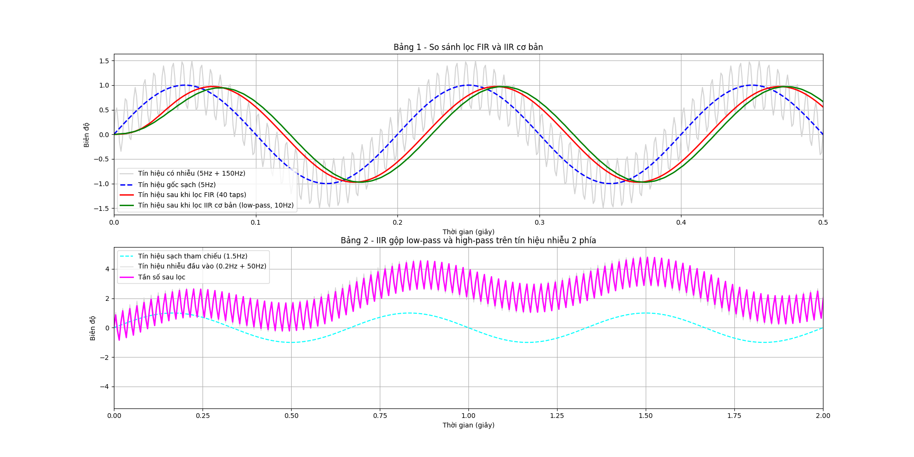
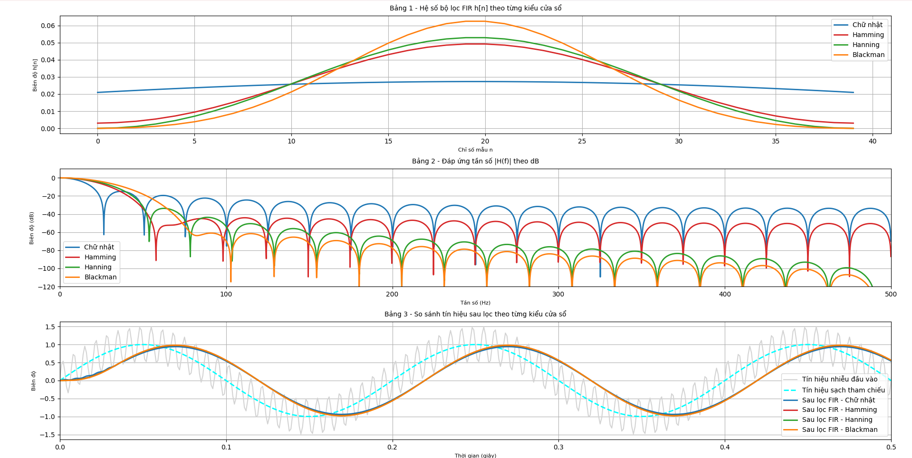

# DSP-PPG

Repository gồm **2 phần chính**:

1. **PPG Analyzer App (`ppg_analyzer/`)**: ứng dụng desktop (PyQt6) để phân tích tín hiệu PPG từ file Excel.
2. **Basic DSP Demo (`basic_DSP/`)**: các script minh họa hàm/tín hiệu cơ bản và bộ lọc FIR/IIR bằng biểu đồ.

## Tính năng chính

### 1) PPG Analyzer App

- Tải dữ liệu PPG từ Excel (3 cột: `timestamp`, `ir`, `red`).
- Tự phát hiện tần số lấy mẫu (Fs), kiểm tra dữ liệu đầu vào.
- Pipeline phân tích gồm 5 chỉ số:
  - HR (Heart Rate)
  - SpO2
  - RR (Respiratory Rate)
  - HRV
  - PI (Perfusion Index)
- Phát hiện vùng nhiễu chuyển động (artifact).
- Giao diện trực quan: vùng đồ thị, panel tham số, panel kết quả.
- Hỗ trợ lưu/đọc cấu hình preset.

### 2) Basic DSP Demo (biểu diễn hàm cơ bản)

- Sinh tín hiệu mẫu (sóng sin sạch + thành phần nhiễu).
- So sánh FIR và IIR low-pass trên cùng tín hiệu.
- Biểu diễn IIR low-pass/high-pass trên tín hiệu nhiễu 2 phía.
- So sánh 4 cửa sổ FIR:
  - Chữ nhật (`boxcar`)
  - Hamming
  - Hanning (`hann`)
  - Blackman
- Vẽ ở miền thời gian, hệ số bộ lọc và đáp ứng tần số (dB).

## Yêu cầu môi trường

- Python 3.10+
- Với **PPG Analyzer App**:
  - `PyQt6`, `numpy`, `scipy`, `pandas`, `openpyxl`, `matplotlib`
- Với **Basic DSP Demo**:
  - `numpy`, `scipy`, `matplotlib`

## Cài đặt

Khuyến nghị tạo virtual environment, sau đó cài dependencies:

```bash
python -m pip install -r ppg_analyzer/requirements.txt
```

## Cách chạy

### Chạy ứng dụng PPG Analyzer

```bash
python ppg_analyzer/main.py
```

- Có thể dùng dữ liệu mẫu: `raw_data/serial_data_1.xlsx`.
- Định dạng file đầu vào mong đợi:
  - Cột thời gian: `timestamp` / `time` / `time_s` / `seconds`
  - Cột IR: `ir` / `infrared`
  - Cột Red: `red` / `red_channel`

### Chạy demo DSP cơ bản

#### So sánh FIR/IIR cơ bản

```bash
python basic_DSP/plotter.py
```

#### So sánh các cửa sổ FIR

```bash
python basic_DSP/plotter_window.py
```

## Ảnh minh họa

### PPG Analyzer App


### `basic_DSP/plotter.py`



### `basic_DSP/plotter_window.py`



## Cấu trúc dự án

```text
DSP-PPG/
├── assets/                    # Hình minh họa giao diện
├── basic_DSP/                 # Demo DSP và biểu diễn hàm cơ bản
│   ├── signal_gen.py
│   ├── FIR.py
│   ├── IIR.py
│   ├── IIR_2side.py
│   ├── plotter.py
│   └── plotter_window.py
├── ppg_analyzer/              # Ứng dụng phân tích PPG
│   ├── main.py
│   ├── requirements.txt
│   ├── core/
│   ├── ui/
│   └── presets/
├── raw_data/                  # Dữ liệu mẫu
└── README.md
```

## Ghi chú

- Repo phục vụ mục tiêu học tập/ứng dụng thực tế cơ bản cho DSP và PPG.
- Các tham số lọc/peak detection có thể điều chỉnh từ ứng dụng (PPG Analyzer) hoặc trong code demo (`basic_DSP`).
