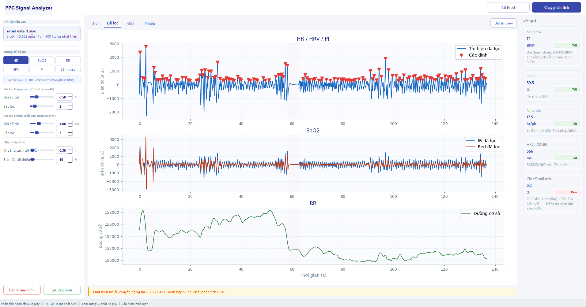

# DSP-PPG

Repo gồm 2 phần:

- **PPG Analyzer (`ppg_analyzer/`)**: ứng dụng desktop (PyQt6) để phân tích PPG từ file Excel.
- **Basic DSP Demo (`basic_DSP/`)**: các script minh họa FIR/IIR và tín hiệu cơ bản.

## Cài đặt

Bạn có 2 cách:

1. **Dùng bản release `.exe`** (không cần cài Python): tải ở trang [Releases](https://github.com/tessal-hub/DSP-PPG/releases).
2. **Chạy từ source**:

```bash
python -m pip install -r ppg_analyzer/requirements.txt
```

## Cách chạy

### PPG Analyzer

```bash
python ppg_analyzer/main.py
```

- Dữ liệu mẫu: `raw_data/serial_data_1.xlsx`
- Cột dữ liệu hỗ trợ:
  - Thời gian: `timestamp` / `time` / `time_s` / `seconds`
  - IR: `ir` / `infrared`
  - Red: `red` / `red_channel`

### Basic DSP Demo

```bash
python basic_DSP/plotter.py
python basic_DSP/plotter_window.py
```

## Ảnh minh họa


